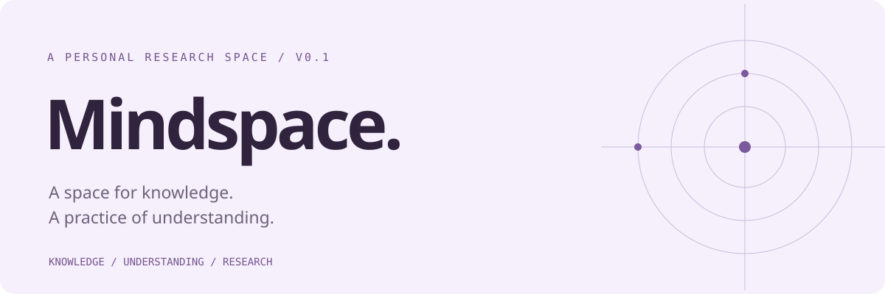

<div align="center">



# Mindspace

**Human × AI Co-evolution · 人与 AI，共同进化。**

用已有的 AI 工具，搭建自己的外置科研大脑。
让知识、个人理解和研究经验，一起积累。

[项目介绍](https://skywaveee.github.io/mindspace/) · [快速开始](docs/getting-started.md) · [工作方法](docs/workflow.md) · [看一个例子](docs/example.md)

`v0.1` · `Markdown first` · `Local first` · `Work in progress`

</div>

---

## 为什么是 Mindspace

论文读过了，讨论聊明白了，换个会话却又从头解释。AI 收集知识的速度越来越快，而自己的理解未必跟得上。

Mindspace 把研究者的长期方向、领域知识、个人判断和项目进展放进一个可以持续维护的空间。下一次开始工作时，人和 AI 都知道：**我们在研究什么，已经知道什么，哪些还没弄明白，下一步为什么这样做。**

它来自个人科研中的实际整理方式。第一版分享的是可复制的结构、读写约定和协作提示词；实验调度、自动训练与自主搜索仍是后续探索。

## 一份知识库，一条共同成长的研究线

| 层面 | 保存什么 | 回答的问题 |
| --- | --- | --- |
| Knowledge · 研究知识 | 来源、方法、适用条件、证据与局限 | 我们已经收集到什么？ |
| Understanding · 个人理解 | 共读进展、自己的解释、疑问与验证 | 我真正理解到哪里？ |
| Research · 研究推进 | 问题、项目状态、决策、经验与下一步 | 这些知识怎样进入研究？ |

**AI 整理过 ≠ 我已经理解；提出过方案 ≠ 实验已经验证。**

知识库可以比自己广。在当前做判断的问题上，让自己的理解逐渐跟上。

## 从一个问题开始

需要 Python 3（仅用于复制模板），以及一个能读写本地文件的 AI 工具；也可以手动复制，无需 Python。Mindspace 本身不调用模型 API、不安装依赖、不需要独立服务。所选 AI 工具的账号、费用和文件权限由该工具管理。

1. 下载本仓库并解压，或克隆到本地。
2. 在仓库目录执行下方命令，把空白模板复制到一个**尚不存在的目录**。
3. 打开个人空间或正在工作的项目，按下表把入口追加到项目规则；没有文件就新建。
4. 新建会话验证实际读取路径，再发送初始化提示词。

```bash
python3 scripts/init.py ~/ResearchMindspace
```

也可以手动把 `template/` 里的内容复制到自己的新目录。

```text
请读取这个目录中的 HOME.md 和 WORKFLOW.md，帮助我初始化 Mindspace。
先问我当前研究方向、正在推进的一个问题，以及已有材料的位置。
每次只问一个问题；不要猜测我的经历和理解程度。
先整理必要入口，再围绕这个问题开始工作，不批量生成计划。
```

完整说明见 [快速开始](docs/getting-started.md)。没有文件工具时，也可把必要文档上传到聊天中，自己保存修订结果。

## 一个轻量的工作空间

```text
ResearchMindspace/
├── HOME.md                 # 我是谁、研究什么、去哪里找
├── WORKFLOW.md             # 人与 AI 的读写约定
├── DAILY.md                # 当天计划、完成与个人随记
├── contexts/               # 长期方向与工作背景
├── knowledge/              # 来源、方法与理解地图
├── projects/               # 项目入口与当前状态
├── ideas/                  # 带依据、尚待验证的 insight
├── decisions/              # 为什么作出或改变判断
└── inbox/                  # 尚未核实、等待整理的材料
```

先用 `HOME.md`、一个问题和几份材料就够了。需要时再增加项目卡和专题。实验代码、原始数据留在各自项目，Mindspace 保存入口和研究判断。

## 接入你正在用的工具

| 工具 | 当前项目根目录的入口文件 |
| --- | --- |
| Codex | `AGENTS.md`（留意已有 override） |
| Claude Code / CC | `CLAUDE.md` |
| Cursor | `AGENTS.md` |
| ZCode Agent | `AGENTS.md` |

文件名是 **AGENTS.md**，不是 Agent.md。已有文件追加，不覆盖原规则。复制 [接入片段](prompts/connect.md)，把 `<MINDSPACE_PATH>` 换成个人空间的实际绝对路径。

不想手动编辑，可以使用 [网页接入生成器](https://skywaveee.github.io/mindspace/#start)，选择工具、填写路径，让 AI 帮你检查和添加。新会话要实际读出 HOME 和 WORKFLOW 的路径，再核对内容；入口本身不授予文件权限。

[逐步图文式指南与官方适配依据](docs/getting-started.md) · [知识与讨论如何回写](docs/workflow.md)

论文摘要、专题、共读笔记与阅读规范分别保存。UNDERSTANDING 只索引自己的问题与理解，不复制知识库；已有文献库可以直接链接。AI 研究的 SFT / OPD / RL / Agent 是可选专题，其他学科自行替换。

按需选用 [共读](prompts/co-read.md)、[交接](prompts/handoff.md) 和 [整理 insight](prompts/insight.md)。

## 持续使用的三个习惯

**开始时恢复问题。** 只读取入口与当前项目的必要上下文，接上最近一个有依据的下一步。

**研究时保留理由。** 方法写适用条件，结论写来源，insight 写如何被检验。遇到冲突时保留差异。

**结束时留下理解。** 记录得到什么、还不确定什么，也记录自己能解释什么；不要把 AI 的总结自动标成已掌握。

[阅读完整工作方法 →](docs/workflow.md)

## 当前边界与后续探索

| v0.1 已包含 | 后续探索，尚未实现 |
| --- | --- |
| 空白模板与非覆盖式初始化 | 自动化配置与更多工具适配 |
| 来源、专题、共读与个人理解索引 | 按理解差距辅助学习 |
| 人工触发的共读、insight 与交接提示词 | 知识检索与维护工具 |
| 明确标注的教学示例 | 实验组织、执行与经验反馈 |

本项目尚未开展多人使用效果评测，也不承诺自动产生科研成果。欢迎从一个实际研究问题出发使用，并反馈在哪一步卡住了。

## 公开模板与私人空间

本仓库只维护通用模板、说明和示例。初始化后的个人空间默认留在本地；如需同步，请自行选择私人存储。不要将个人空间直接合并回公开模板。示例均明确标注为教学示例，不代表真实实验结果。

`site-manifest.json` 列出可同步到网站和下载包的文件；网站不会扫描使用者的个人目录。维护与验证方式见 [维护说明](docs/maintaining.md)。

## 致谢与许可

设计受到 [AIBuildAI 的领域知识系统](https://github.com/aibuildai-inc/aibuildai-knowledge-base)等工作的启发；本项目独立编写，未复制其知识语料。Mindspace 把研究者自身的理解进展也纳入维护。

由 [skywaveee](https://github.com/skywaveee) 持续维护。采用 [MIT License](LICENSE)。
